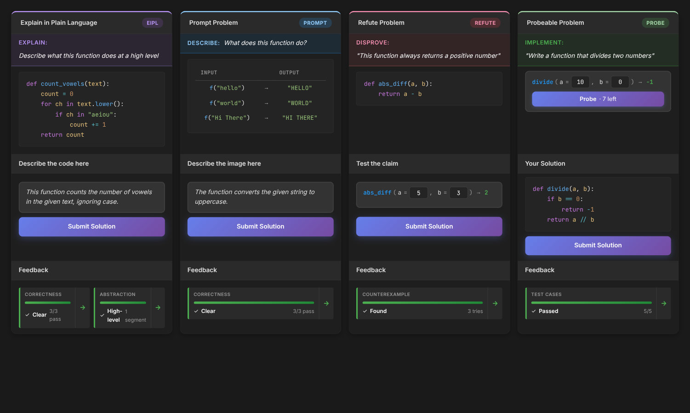

<div align="center">
  
  <h1>Purplex</h1>
  <p><strong>An educational coding challenge platform with AI-powered problem generation, sandboxed Docker code execution, and a novel EiPL (Explain in Plain Language) submission system for assessing conceptual understanding.</strong></p>

  <p>
    <a href="https://github.com/CoffeePoweredComputers/purplex/actions/workflows/ci.yml"></a>
    <a href="https://github.com/CoffeePoweredComputers/purplex/actions/workflows/security.yml"></a>
    <a href="https://codecov.io/gh/CoffeePoweredComputers/purplex"></a>
  </p>

  <p>
    <a href="https://www.gnu.org/licenses/gpl-3.0"></a>
    <a href="https://www.python.org/downloads/"></a>
    <a href="https://www.djangoproject.com/"></a>
    <a href="https://vuejs.org/"></a>
  </p>
</div>

<div align="center">
  
  <br><em>Four problem types: Explain in Plain Language, Prompt, Refute, and Probeable</em>
</div>

## Features

- **AI Problem Generation** -- GPT-4 and Llama-powered problem creation across multiple types (code, MCQ, EiPL, debug-fix, refute, probeable)
- **Sandboxed Execution** -- Docker containers with resource limits, network isolation, and timeout enforcement
- **EiPL System** -- Students explain code behavior in plain language; AI evaluates conceptual understanding
- **Multi-Modal Hints** -- Variable Fade, Subgoal Highlighting, and Suggested Trace hint strategies
- **Privacy Compliance** -- GDPR, FERPA, COPPA, and DPDPA consent management with data export and account deletion
- **Progress Tracking** -- Per-student analytics, instructor dashboards, and research data export with anonymization
- **Course Management** -- Instructor roles, problem set organization, enrollment, and team management

## Translation Status

<!-- i18n-badges:start -->
[](purplex/client/src/i18n/locales/bn/)
[](purplex/client/src/i18n/locales/mi/)
<!-- i18n-badges:end -->

Help translate Purplex into your language! See [CONTRIBUTING_TRANSLATIONS.md](CONTRIBUTING_TRANSLATIONS.md) for guidelines.

## Quick Start

```bash
# Prerequisites: Python 3.11+, Docker, Node.js 20+

# Clone and set up
cp .env.example .env.development    # Edit to add your API keys
python -m venv env && source env/bin/activate
pip install -r requirements.txt

# Start everything (PostgreSQL, Redis, Django, Celery, Vue, Flower)
./start.sh
```

| Service           | URL                        |
|-------------------|----------------------------|
| Frontend          | http://localhost:5173       |
| Django API        | http://localhost:8000       |
| Admin Panel       | http://localhost:8000/admin |
| Flower (Celery)   | http://localhost:5555       |

Development uses mock Firebase auth -- no external setup required.

## Tech Stack

**Backend:** Django 5.0 &middot; Django REST Framework &middot; PostgreSQL 15 &middot; Celery + Redis &middot; Firebase Auth

**Frontend:** Vue 3 &middot; TypeScript &middot; Vite &middot; Vuex 4 &middot; Ace Editor

**Infrastructure:** Docker &middot; Gunicorn &middot; SSE for real-time updates

## Testing

```bash
pytest                  # All tests
pytest -m unit          # Unit tests only
pytest -m integration   # Integration tests only
cd purplex/client && npm run test   # Frontend tests
```

## Documentation

| Document | Description |
|----------|-------------|
| [Development Guide](docs/development/DEVELOPMENT.md) | Setup, workflows, troubleshooting, environment config |
| [Architecture](docs/architecture/ARCHITECTURE.md) | System design, data flows, and key decisions |
| [Standards](docs/development/STANDARDS.md) | Coding conventions and required patterns |
| [Patterns](docs/development/PATTERNS.md) | Implementation examples and templates |
| [Deployment](docs/deployment/DOCKER_DEPLOYMENT.md) | Docker and production deployment |
| [Security](docs/security/SECURITY.md) | Security practices and configuration checklist |
| [Testing](docs/reference/TESTING.md) | Test framework, factories, and fixtures |
| [Changelog](CHANGELOG.md) | Release history |

## Contributing

See [CONTRIBUTING.md](CONTRIBUTING.md) for guidelines. For security issues, see [SECURITY.md](SECURITY.md).

## License

[GNU General Public License v3.0](LICENSE)
